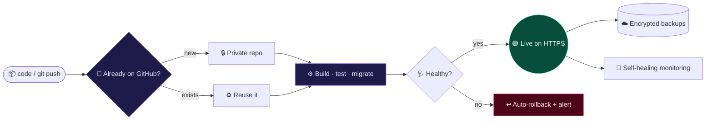

 

   

**Senior Full-Stack Engineer** · Laravel · Next.js · FastAPI · Flutter · Generative AI 
📍 Amman, Jordan · 🌍 Remote / relocation · 💼 Full-time or contract

 

## ⚡ About me

I build **complete products, end to end**: the product idea, the UI, the API, the AI layer, and the infrastructure they run on.

- 🏛️ **6+ years** delivering enterprise-grade web apps, **e-government** solutions, and high-traffic platforms serving **100K+ users**
- 🧠 Integrating **Generative AI** (LLMs, LangChain, AI agents) into real business workflows, not just demos
- 🔁 Modernizing **legacy systems** into scalable, cloud-native architectures
- 🌍 Bilingual (Arabic / English), working with teams across the **USA, MENA, Canada & Europe**

## 📈 Impact highlights

| | Result |
|---|---|
| ⚡ | **200% efficiency gain** migrating a US medical platform off its legacy architecture |
| 🔎 | **+150% SEO growth** through technical SEO, caching, and database tuning |
| 🗄️ | **10,000+ sensitive records** migrated from legacy ASP.NET to modern SQL with **zero data loss** |
| 🛒 | E-commerce platforms handling **$100K+ in monthly transactions** |
| 🚦 | **90+ Lighthouse scores** and **99.9% uptime** on the platforms I run |
| 🤖 | Deploys that went from manual work to **one command (~60s)**, with automatic rollback |

## 🚀 Flagship work

<table>
<tr>
<td width="50%" valign="top">

### ⚙️ kafo-deploy: my own PaaS
📄 **[Read the case study →](https://github.com/abdelqader-alomari/kafo-deploy-case-study)**

A self-hosted **Vercel/Heroku-style platform**. Upload a zip or `git push` and get a **live HTTPS site in about a minute**.

- 5 stacks: **Laravel · Next.js · FastAPI · Node · static**
- Zero-touch provisioning of the site, DNS, TLS, and database
- Auto-deploy on every push, with **automatic rollback** when a release is unhealthy
- Detects whether a project **already exists on GitHub** by fingerprinting the code, not just the name
- Encrypted off-site backups, one-click restore, self-healing monitoring, dependency audits

   

</td>
<td width="50%" valign="top">

### 🤖 Project Brian: AI executive assistant
📄 **[Read the case study →](https://github.com/abdelqader-alomari/project-brian-case-study)**

A personal **AI chief-of-staff** that lives on **WhatsApp** and talks by **voice**, with an executive control dashboard.

- LLM agent with tools and long-term memory
- WhatsApp messaging + real-time voice conversations
- An executive dashboard for oversight and control

    

</td>
</tr>
<tr>
<td width="50%" valign="top">

### 🕌 Islam Guide
📄 **[Read the case study →](https://github.com/abdelqader-alomari/islam-guide-case-study)**

A highly scalable **educational platform serving users in the United States**: a Course Builder LMS, interactive book readers, a multimedia hub (YouTube / SoundCloud), and a location-aware prayer-times dashboard.

 

🔗 **[islamguide.us](https://islamguide.us)**

</td>
<td width="50%" valign="top">

### 🌱 Kafo Platform: a full ecosystem
📄 **[Read the case study →](https://github.com/abdelqader-alomari/kafo-platform-case-study)**

The complete digital backbone of a youth development team in Amman, serving volunteers across MENA: main platform, recruitment, **digital library**, video meetings, task management, webmail, cloud drive, and committees, all designed and built by me.

   

🔗 **[kafo.team](https://kafo.team)** · **[library.kafo.team](https://library.kafo.team)** · **[join.kafo.team](https://join.kafo.team)**

</td>
</tr>
<tr>
<td width="50%" valign="top">

### 🌐 Web Maestro: digital agency platform
📄 **[Read the case study →](https://github.com/abdelqader-alomari/web-maestro-case-study)**

The agency's own platform: a premium glassmorphic UI with smooth transitions, a **stateful AI chatbot** that qualifies leads, and **automated client-intake webhooks**.

   

🔗 **[webmaestroo.com](https://webmaestroo.com)**

</td>
<td width="50%" valign="top">

### 👤 abdelqader.pro: bilingual portfolio
My personal site: a fast, **bilingual (English / Arabic, RTL)** portfolio with a downloadable PDF CV, server-rendered by **FastAPI** and served through a CDN.

   

🔗 **[abdelqader.pro](https://abdelqader.pro)**

</td>
</tr>
<tr>
<td width="50%" valign="top">

### 🎓 AI-powered adaptive learning platform
An **adaptive LMS** with custom LLM pipelines that generate study guides, an automated assessment engine built on **Bloom's Taxonomy**, and a stateful AI chat tutor for personalized coaching.

  

</td>
<td width="50%" valign="top">

### 📱 Moltaqa Live
📄 **[Read the case study →](https://github.com/abdelqader-alomari/moltaqa-live-case-study)**

A **live-streaming mobile app** (iOS & Android) with real-time audio/video rooms, secure token generation, and real-time data.

  

</td>
</tr>
</table>

<b>🗂️ More things I've built</b>

 

| Project | What it is | Stack |
|---|---|---|
| 🏥 **US medical platform** | Migrated a legacy health platform to a modern architecture (**200% efficiency gain**), with Python analytics on booking trends | Laravel · Python |
| 📺 **"Arab in America" streaming** | High-traffic media platform built for concurrent users, with AI content recommendations | Laravel Livewire · AI |
| 🔐 **Enterprise CRM for HNWI profiles** | High-security CRM with database encryption and strict privacy compliance; 10,000+ records migrated from legacy ASP.NET with zero data loss | Laravel · Python |
| 🤝 **CRM & AI workflow system** | Kanban deal boards, a visual workflow builder, AI sentiment analysis of emails, auto-generated follow-ups | LLMs · AI pipelines |
| 🏗️ **Structural engineering suite** | Structural-analysis calculators with formula APIs and background workers that generate verification PDF reports | Python |
| 🛒 **Automotive parts e-commerce** | High-speed inventory search, Stripe & PayPal, order dispatch workflows, database sync workers | Stripe · PayPal |
| 🩺 **Clinic booking platform** | Calendar scheduling engine, automated SMS workflows, secure practitioner portals | Webhooks · SMS |
| 🧑‍💼 **Graduates ↔ jobs marketplace** | Bridging fresh graduates and the tech & vocational job market | TypeScript |
| 🎥 **Teacher video platform** | Video subscriptions & exams for independent teachers | LMS |
| 🧱 **Website builder** | A website builder for small businesses | Laravel · Blade |
| ⚡ **Real-time TALL app** | Live updates over WebSockets with Laravel Reverb | TALL · Reverb |
| 🧩 **Self-hosted AI stacks** | n8n, Flowise, Chatwoot, Plane, Metabase, Activepieces, OCR, and pgvector RAG, wired to LLMs | Docker · n8n |
| 🔳 **Ramz QR** | Fast, clean QR code generator ([qr.apps2026.cloud](https://qr.apps2026.cloud)) | FastAPI |
| 🍽️ **Digital QR menus** · 📅 **appointment booking** | Small-business SaaS tools | PHP · JavaScript |

**🔨 In progress:** an HR & payroll suite · a ride-hailing app for Jordan · a Tawjihi exam-prep app · a network payment-gateway integration for mobile

## 🧭 Stack → projects

| Stack | Where I've used it |
|---|---|
|  **Laravel · Livewire · Inertia** | Kafo platform (library, recruitment, tasks, webmail, drive), US medical platform, "Arab in America" streaming, enterprise CRMs, e-commerce |
|  **Next.js · React** | Islam Guide, Web Maestro, Kafo Library (React SSR), graduates ↔ jobs marketplace |
|  **FastAPI · Python** | abdelqader.pro, Project Brian, kafo-deploy's dashboard, Ramz QR, structural engineering suite, AI learning platform |
|  **Flutter · Firebase** | Moltaqa Live (iOS & Android live streaming) |
|  **LLMs · LangChain · RAG** | Brian, adaptive learning platform, CRM sentiment analysis, content & support automation |
|  **Docker · Linux · CI/CD** | kafo-deploy (my own PaaS), self-hosted AI stacks, production servers |

## 🏗️ How I ship

## 💼 Experience

| Role | Where | When |
|---|---|---|
| **Senior Lead Software Engineer** | Web Maestro: global clients (USA, KSA, Canada), remote | 2023 → now |
| **Full-Stack Web Developer** | Bluemina Citizenship & Residency, Amman | 2022 → 2023 |
| **Independent Software Contractor** | 15+ projects for clients in Jordan, USA, Canada & KSA | 2019 → 2023 |
| **Technical Data Analyst** | MAKANI project (UNICEF): data systems for 50,000+ beneficiaries | 2017 → 2019 |

## 🎓 Education

- 🥇 **Advanced Software Development**: ASAC / LTUC, powered by **Code Fellows** (Seattle). 2200+ practical hours, **99.6%, top of class**
- ⚙️ **B.S. Mechanical Engineering**, University of Jordan
- 📜 **Certifications:** Laravel Certified Developer · AWS Cloud Practitioner · Agile / Scrum

## 🧰 Tech stack

**Web & frontend** 

**Backend, mobile & AI** 

**Data & infrastructure** 

<b>🧠 AI toolbox</b> (click to expand)

 

| Area | What I use it for |
|---|---|
| **LLMs & AI agents** | Assistants with tools & memory, content generation, support automation |
| **LangChain · RAG · vector search** | Grounding answers in private documents & databases |
| **n8n · Flowise** | AI automations connected to real business systems |
| **Voice & WhatsApp** | Assistants people actually talk to, where they already are |
| **Python analytics** | Pandas / NumPy insights and web-scraping pipelines |

## 📫 Let's talk

Have a product to build, a legacy system to modernize, or an AI idea to take to production?

 

  

